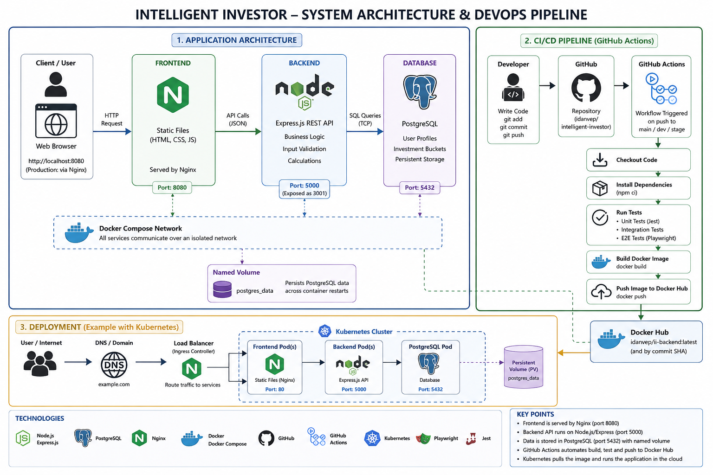

# Intelligent Investor Platform

## Project Overview

The Intelligent Investor Platform is a personal finance web application built as part of a DevOps course project.

The application allows a user to enter a gross monthly salary and receive an automatic financial allocation based on personal finance buckets:

* Fixed Costs
* Savings Goals
* Active Investments
* Guilt-Free Spending

The system also calculates a 15-year wealth projection using a 7% annual return assumption.

The main goal of this project is not only to build a working financial web application, but also to demonstrate a complete DevOps workflow including Git, Docker, Docker Compose, automated testing, and CI/CD with GitHub Actions.

---

## Architecture

The project is built from three main services:

```text
Browser
  |
  | localhost:8080
  v
Frontend - Nginx static server
  |
  | API calls to localhost:3001
  v
Backend - Node.js / Express API
  |
  | PostgreSQL connection
  v
Database - PostgreSQL 15
```
The following diagram presents the application architecture, CI/CD pipeline,
Docker Compose environment, and Kubernetes deployment.




### Services

| Service          | Technology              | Purpose                                               |
| ---------------- | ----------------------- | ----------------------------------------------------- |
| Frontend         | HTML, JavaScript, Nginx | User interface                                        |
| Backend          | Node.js, Express        | API and financial calculation logic                   |
| Database         | PostgreSQL              | Stores calculation results                            |
| CI/CD            | GitHub Actions          | Runs tests, builds Docker image, pushes to Docker Hub |
| Containerization | Docker, Docker Compose  | Runs the full system consistently                     |

---

## Project Structure

```text
intelligent-investor/
├── backend/
│   ├── src/
│   │   ├── app.js
│   │   ├── calculator.js
│   │   ├── db.js
│   │   └── routes/
│   │       ├── calculate.js
│   │       └── health.js
│   ├── tests/
│   │   ├── unit/
│   │   │   └── calculator.test.js
│   │   └── integration/
│   │       └── api.test.js
│   ├── Dockerfile
│   ├── .dockerignore
│   ├── package.json
│   └── package-lock.json
├── frontend/
│   ├── index.html
│   └── app.js
├── db/
│   └── init.sql
├── .github/
│   └── workflows/
│       └── docker-backend.yml
├── docker-compose.yml
├── .gitignore
└── README.md
```

---

## Backend API

### Health Check

```http
GET /health
```

Checks whether the backend is running and whether the database connection works.

Example response:

```json
{
  "status": "ok",
  "uptime": "20 seconds",
  "database": "connected"
}
```

---

### Calculate Financial Plan

```http
POST /calculate
```

Example request:

```json
{
  "grossSalary": 10000,
  "years": 15
}
```

Example response:

```json
{
  "grossSalary": 10000,
  "bankNet": 6800,
  "fixedCosts": 3570,
  "savingsGoals": 680,
  "activeInvestments": 680,
  "guiltFreeSpending": 1870,
  "wealthProjection": [
    8426.96,
    17455.45,
    27129.26
  ]
}
```

---

## Financial Logic

The financial logic is separated into a pure business logic file:

```text
backend/src/calculator.js
```

This file does not use Express, HTTP requests, responses, or database logic.

This separation makes the financial logic easy to test with unit tests.

### Bucket Allocation

The bank net salary is divided into:

| Bucket              | Percentage |
| ------------------- | ---------: |
| Fixed Costs         |      52.5% |
| Savings Goals       |        10% |
| Active Investments  |        10% |
| Guilt-Free Spending |      27.5% |

The percentages add up to 100%.

### Wealth Projection

The platform calculates future investment value using a monthly annuity formula with a 7% annual return.

---

## How to Run Locally Without Docker

From the backend folder:

```bash
cd backend
npm install
npm run dev
```

The backend will run on:

```text
http://localhost:5000
```

Example API test:

```bash
curl http://localhost:5000/health
```

---

## How to Run With Docker Compose

From the project root:

```bash
docker compose up --build
```

The system will start three services:

| Service    | URL / Port            |
| ---------- | --------------------- |
| Frontend   | http://localhost:8080 |
| Backend    | http://localhost:3001 |
| PostgreSQL | localhost:5432        |

To stop the system:

```bash
docker compose down
```

To stop the system and remove the database volume:

```bash
docker compose down -v
```

---

## Database

The database service uses PostgreSQL 15.

The initialization script is located at:

```text
db/init.sql
```

It creates the `last_calculation` table automatically when the database container is first initialized.

The database uses a named Docker volume:

```text
db_data
```

This allows database data to persist across container restarts.

---

## Running Tests

From the backend folder:

```bash
cd backend
```

Run unit tests:

```bash
npm run test:unit
```

Run integration tests:

```bash
npm run test:integration
```

Run all tests:

```bash
npm test
```

### Test Types

| Test Type         | Purpose                                   |
| ----------------- | ----------------------------------------- |
| Unit Tests        | Test pure financial calculation functions |
| Integration Tests | Test Express API routes using Supertest   |

The integration tests mock the database connection so they can run without Docker or PostgreSQL.

---

## Docker

The backend has its own Dockerfile:

```text
backend/Dockerfile
```

The Docker image uses:

```text
node:18-alpine
```

The production image copies only the backend source code and production dependencies.

The `.dockerignore` file excludes unnecessary files such as:

* `node_modules`
* tests
* `.env`
* Git files

---

## CI/CD Pipeline

The CI/CD pipeline is implemented using GitHub Actions.

Workflow file:

```text
.github/workflows/docker-backend.yml
```

The pipeline runs automatically on pushes to:

* `main`
* `stage`
* `dev`
* `feature/**`

### Pipeline Steps

1. Checkout code
2. Setup Node.js 18
3. Install backend dependencies with `npm ci`
4. Run unit tests
5. Run integration tests
6. Login to Docker Hub
7. Build backend Docker image
8. Push Docker image to Docker Hub

The Docker image is tagged with:

* `latest`
* the Git commit SHA

---

## Docker Hub Image

Backend image:

```text
YOUR_DOCKERHUB_USERNAME/ii-backend:latest
```

To pull the image:

```bash
docker pull YOUR_DOCKERHUB_USERNAME/ii-backend:latest
```

To run the backend image manually:

```bash
docker run -p 3005:5000 YOUR_DOCKERHUB_USERNAME/ii-backend:latest
```

---

## Git Workflow

The project uses a Git workflow with the following branches:

| Branch      | Purpose                         |
| ----------- | ------------------------------- |
| `main`      | Stable production-ready branch  |
| `stage`     | Pre-production / staging branch |
| `dev`       | Development integration branch  |
| `feature/*` | Feature-specific work branches  |

Example workflow:

```text
feature/github-actions
        ↓
dev
        ↓
stage
        ↓
main
```

This keeps changes organized and makes the project history easier to understand.

---

## Environment Variables

The backend reads database configuration from environment variables:

| Variable      | Description         |
| ------------- | ------------------- |
| `DB_HOST`     | Database host       |
| `DB_PORT`     | Database port       |
| `DB_NAME`     | Database name       |
| `DB_USER`     | Database username   |
| `DB_PASSWORD` | Database password   |
| `PORT`        | Backend server port |

In Docker Compose, these values are provided through `docker-compose.yml`.

In CI/CD, Docker Hub credentials are stored securely as GitHub repository secrets:

* `DOCKERHUB_USERNAME`
* `DOCKERHUB_TOKEN`

---

## Technologies Used

* Node.js
* Express.js
* PostgreSQL
* HTML
* JavaScript
* Nginx
* Docker
* Docker Compose
* Jest
* Supertest
* Git
* GitHub
* GitHub Actions
* Docker Hub

---

## Kubernetes Deployment

The project can also run inside a local Kubernetes cluster using kind.

The Kubernetes configuration is stored in:

```text
k8s/
├── cluster-config.yaml
├── backend-config.yaml
├── backend.yaml
└── postgres.yaml

kind create cluster --config k8s/cluster-config.yaml

docker build -t ii-backend:k8s ./backend
kind load docker-image ii-backend:k8s --name intelligent-investor

kubectl create secret generic ii-db-secret \
  --from-literal=DB_PASSWORD=postgres

  kubectl apply -f k8s/backend-config.yaml
kubectl apply -f k8s/postgres.yaml
kubectl apply -f k8s/backend.yaml

kubectl get nodes
kubectl get pods
kubectl get services
kubectl get pvc

kubectl port-forward service/ii-backend-service 3002:5000

http://localhost:3002/health


ה־Deployment, Service, ConfigMap, Secret, probes, scaling ו־rollback תואמים לנושאים שנבנו ב־Kubernetes Workshop. :contentReference[oaicite:0]{index=0}

---

## 3. בדיקה לפני commit

```powershell
git branch --show-current
git status


## Project Status

Completed:

* Backend API
* Frontend UI
* PostgreSQL database
* Dockerfile
* Docker Compose setup
* Unit tests
* Integration tests
* Git workflow
* GitHub Actions CI/CD pipeline
* Docker Hub image publishing
